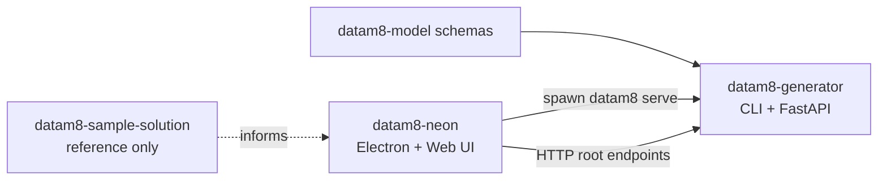

## Purpose
`datam8-generator` is the backend for DataM8 v2: CLI commands and FastAPI server used by Neon.

## How the Repositories Fit Together (v2)
- `datam8-model`: source-of-truth v2 schemas.
- `datam8-sample-solution`: reference solution shape used by CI tests in this repo.
- `datam8-generator`: canonical backend (`datam8` CLI + FastAPI).
- `datam8-neon`: Electron + web editor that launches `datam8 serve` and calls the backend over HTTP.

Data flow:
- Neon spawns `datam8 serve --host 127.0.0.1 --port 0 --token ...`.
- Backend returns readiness JSON line with `baseUrl` and `version`.
- Neon calls root HTTP endpoints (no `/api/*` namespace).
- Long-running work is currently synchronous/blocking (no Jobs/SSE endpoint layer).

## Key Entry Points
- CLI app root: `src/datam8/app.py`
- Commands:
  - `serve`: `src/datam8/cmd/serve.py`
  - `generate`: `src/datam8/cmd/generate.py`
  - `validate`: `src/datam8/cmd/validate.py`
  - `index` APIs and workspace ops: `src/datam8/core/workspace_io.py`
- FastAPI app + middleware: `src/datam8/api/app.py`
- Routes:
  - system: `src/datam8/api/routes/system.py`
  - workspace/connector/generation routes: `src/datam8/api/routes/api.py`

## Integration with Neon (Stability Contract)
Must remain stable unless contract changes are explicitly coordinated:
- Startup readiness JSON from `datam8 serve`
- Token-auth behavior (`Bearer` token for non-health endpoints)
- Root endpoint paths currently consumed by Neon

Canonical backend contract doc:
- `docs/backend-contract.md`

Neon links to this file and should not duplicate endpoint details.

## Test Solution
CI tests use the sample solution repository:
- `oraylis/datam8-sample-solution` (`feature/v2`)
- solution file: `ORAYLISDatabricksSample.dm8s`

For local test runs, pass `--solution-path` or set `DATAM8_SOLUTION_PATH`.

## Scope Rules
- UI-only requirement: change Neon only.
- Core generate/validate/index semantics: change Generator only; Neon gets wiring only.
- Cross-repo feature: coordinated generator + Neon changes + contract doc update + end-to-end test.
- Contract change: update `docs/backend-contract.md` first, then code/tests in both repos.

## Test Rules (Test What You Ship)
- Backend-only changes: generator unit/integration tests required.
- Cross-repo changes: at least one end-to-end flow test:
  - `UI -> request -> backend completion -> output/state assertions`.

## CI Quality Gates
Always ensure both commands succeed locally before finishing changes, because they are part of the GitHub workflow:
- `uv tool run pyright src`
- `uv tool run ruff check src`

## Patch Checklist
- Contract impact assessed; `docs/backend-contract.md` updated if needed.
- Tests added/updated for changed behavior.
- `uv tool run pyright src` and `uv tool run ruff check src` pass.
- Test setup verified with sample-solution checkout and `DATAM8_SOLUTION_PATH`.
- Docs kept concise and linked to canonical sources.
