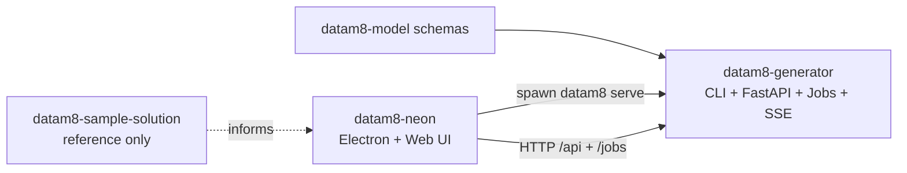

## Purpose
`datam8-generator` is the backend for DataM8 v2: CLI commands, FastAPI server, and Jobs/SSE execution used by Neon.

## How the Repositories Fit Together (v2)
- `datam8-model`: source-of-truth v2 schemas.
- `datam8-sample-solution`: reference solution shape only; not required for tests in this repo.
- `datam8-generator`: canonical backend (`datam8` CLI + FastAPI + Jobs + SSE).
- `datam8-neon`: Electron + web editor that launches `datam8 serve` and calls the backend over HTTP.

Data flow:
- Neon spawns `datam8 serve --host 127.0.0.1 --port 0 --token ...`.
- Backend returns readiness JSON line with `baseUrl` and `version`.
- Neon calls `/api/*` for workspace operations.
- Long-running work runs through `/jobs` and SSE `/jobs/:id/events`.

## Key Entry Points
- CLI app root: `src/datam8/app.py`, `src/datam8/cli/main.py`
- Commands:
  - `serve`: `src/datam8/cmd/serve.py`
  - `generate`: `src/datam8/cmd/generate.py`
  - `validate`: `src/datam8/cmd/validate.py`
  - `index` APIs and workspace ops: `src/datam8/core/workspace_io.py`
- FastAPI app + middleware: `src/datam8/api/app.py`
- Routes:
  - system: `src/datam8/api/routes/system.py`
  - jobs: `src/datam8/api/routes/jobs.py`
  - `/api/*` workspace/connector routes: `src/datam8/api/routes/legacy_api.py`

## Jobs: Why Subprocess Spawn Matters
Jobs execute long-running commands by spawning CLI subcommands to keep behavior consistent with direct CLI usage.

- Frozen binary runtime: spawn with `sys.executable <command> ...`
- Dev runtime: spawn with `python -m datam8 <command> ...`

Implementation: `src/datam8/core/jobs/manager.py`

Keep this invariant stable so desktop and CLI paths behave identically.

## Integration with Neon (Stability Contract)
Must remain stable unless contract changes are explicitly coordinated:
- Startup readiness JSON from `datam8 serve`
- Token-auth behavior (`Bearer` token for non-health endpoints)
- Jobs endpoints and SSE format
- `/api/*` endpoints currently consumed by Neon

Canonical backend contract doc:
- `docs/backend-contract.md`

Neon links to this file and should not duplicate endpoint details.

## Local Test Solutions
All tests in this repo must be runnable without cloning an external solution repository.

Primary local fixture:
- `tests/fixtures/solutions/minimal-v2/minimal.dm8s`

This fixture includes:
- `.dm8s` metadata
- `Base/` minimal entities
- `Model/` minimal valid entity
- `Generate/dummy/` minimal templates + payload module
- `Output/` folder for generation assertions

## Scope Rules
- UI-only requirement: change Neon only.
- Core generate/validate/index semantics: change Generator only; Neon gets wiring only.
- Cross-repo feature: coordinated generator + Neon changes + contract doc update + end-to-end test.
- Contract change: update `docs/backend-contract.md` first, then code/tests in both repos.

## Test Rules (Test What You Ship)
- Backend-only changes: generator unit/integration tests required.
- Cross-repo changes: at least one end-to-end flow test:
  - `UI -> POST /jobs -> SSE stream -> completion -> output/state assertions`.
- Job-related backend changes should include HTTP server job tests with SSE assertions.

## CI Quality Gates
Always ensure both commands succeed locally before finishing changes, because they are part of the GitHub workflow:
- `uv tool run pyright src`
- `uv tool run ruff check src`

## Patch Checklist
- Contract impact assessed; `docs/backend-contract.md` updated if needed.
- Subprocess job behavior preserved (frozen vs dev path).
- Tests added/updated for changed behavior.
- `uv tool run pyright src` and `uv tool run ruff check src` pass.
- Local fixtures used; no external sample-solution dependency required.
- Docs kept concise and linked to canonical sources.
